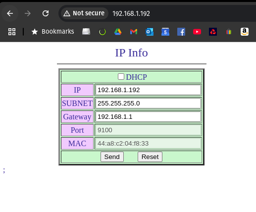
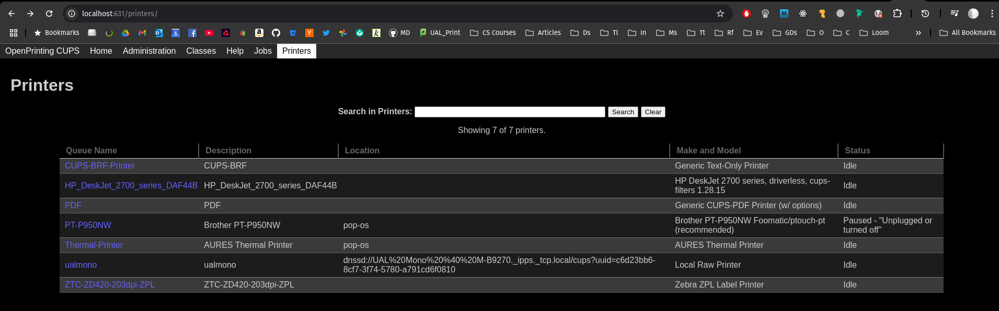
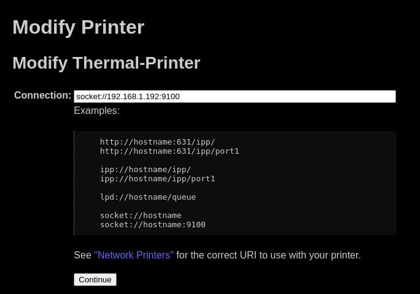

# Printer Hub

```
   +--------+
  /        /|
 /        / |
+--------+  |
|        |  |
| -----  |  +
|        | /
|        |/
+--------+
```

## Networking the printer

1. **Find out the IP address of your printer.** You can do this by printing out the printers current settings [like this man does in this video](https://www.youtube.com/watch?v=dIrkViLUknA&ab_channel=JasonWicks). On the printout you will see the printers IP address. For the sake of example mine _was_ `192.168.0.192`.
2. **Leave the printer connected to your router and turned on.**
3. **Try `ping`-ing the printer.** If you can `ping 192.168.0.192` then the printer is ready to receive commands and you can skip to step **10**.
4. **Find out your machines IP address.** If your printer was not `ping`-able, as mine wasn't, then it is likely on a different subnetwork. You can do this with `ip addr show`. You'll probably get a load of stuff which at first is indecipherable, but if you're connected to WiFI (like, who isn't?) there'll likely be an entry a lot like `wlp0s20f3`:

```
3: wlp0s20f3: <BROADCAST,MULTICAST,UP,LOWER_UP> mtu 1500 qdisc noqueue state UP group default qlen 1000
    link/ether 34:7d:f6:df:43:64 brd ff:ff:ff:ff:ff:ff
    inet 192.168.1.13/24 brd 192.168.1.255 scope global dynamic noprefixroute wlp0s20f3
       valid_lft 53986sec preferred_lft 53986sec
```

Your IP address will be the one after `inet`: `inet 192.168.1.13/24`. The `/24` refers to the subnet mask, in this case `/24` means 24 bits are used for the mask, ie `255.255.255.0`, as you'll likely see as a subnet mask.

So, we can now see that the printer and my laptop are on _different subnets_, note the third field: `192.168.0.192` and `192.168.1.13`. This is why the printer in un-`ping`-able.

5. **Temporarily change our IP address.** This seemed scary at first, but turns out it's proper chill. You can add a temporary IP with:

```bash
sudo ip addr add 192.168.0.100/24 dev wlp0s20f3
```

Make sure you're setting a subnet mask which matches your printer, in my case that means setting the third field to `0`.

6. **Now try `ping`-ing your printer.** `ping 192.168.0.192`. This worked for me. If this doesn't work then I dunno what you should do next. You _should_ be able to get to your printers GUI on that IP: `http://192.168.0.192`, and it should look something like this:



7. **Change the printer IP address.** Change the IP address to one on your subnet, I just changed the `0` to a `1`. AFAIK the higher numbers are less likely to clash with pre-existing _stuff_, so leaving the `192` felt fine. I also changed the gateway to `192.168.1.1`. I don't know if the final number being `1` will always be your gateway, but again AFAIK, you can test this by going to `http://192.169.1.1` and you _should_ see your router's GUI where you can change the WiFi password and stuff.
8. **Revert your IP address.** Changing the IP might (should) mess up the page cos it's now being served from a different IP. But that's ok, now just run:

```bash
sudo ip addr del 192.168.0.100/24 dev wlp0s20f3
```

to remove the temporary IP address and then `ping 192.168.1.192` to see if you're now both on the same network. This worked for me, so if it didn't for you then I dunno.

> For the remaining faff I'm going to assume you have installed the drivers for the big boy **Aures ODP 333** printer ([drivers here](https://aures-support.com/en/receipt-printers/aures-printers/)), and also have [CUPS](https://openprinting.github.io/cups/) installed ([or possibly the Apple one](https://www.cups.org/), not sure of the difference). CUPS should come with `lpstat` and `lpoptions` and `lp` I believe. I also did these steps slightly at random when I was troubleshooting so some things you may _need_ to do, others you might not.

10. **Find the printer in CUPS.** If you have CUPS installed, it should be running it's own GUI on `http://localhost:631`. If your Aures printer is not appearing, temporarily connect it via USB and it should. Mine is called _Thermal-Printer_.



11. **Change the printer to a socket based connection.** Click on the printer and in the dropdown which should currently say _Administration_, choose _Modify_. The _Current Connection_ should (might) show a USB connection, we want to change this. At the bottom choose `AppSocket/HP JetDirect`. Press continue and in the _Connection_ field at the IP address of your printer with the port `9100`:



then just click _Continue_, _Continue_ and _Modify_ to complete the changes. The connection should now show `Connection: socket://192.168.1.192:9100`. We can test this also with `lpstat -v Thermal-Printer` which should give `device for Thermal-Printer: socket://192.168.1.192:9100`.

12. **PRINT SOMETHING.** We can finally print something. Do this:

```bash
echo "Test print $(date)" > test.txt
lp -d Thermal-Printer -o raw test.txt
```

and watch the wonderous joy of thermal printing over a home network.
